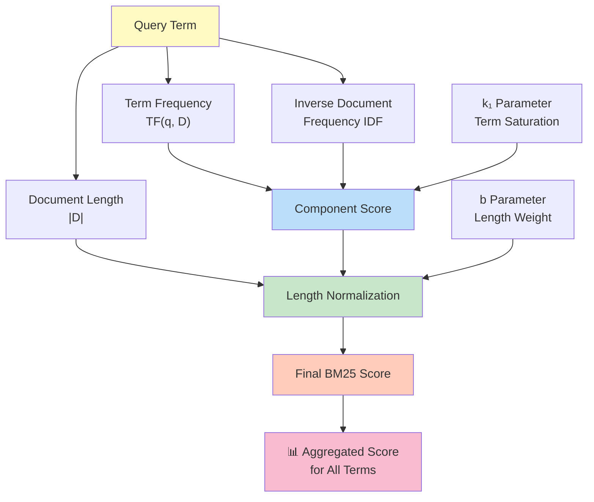
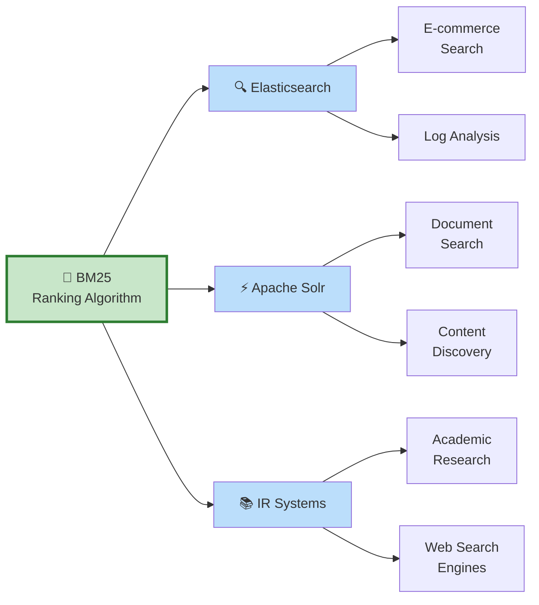
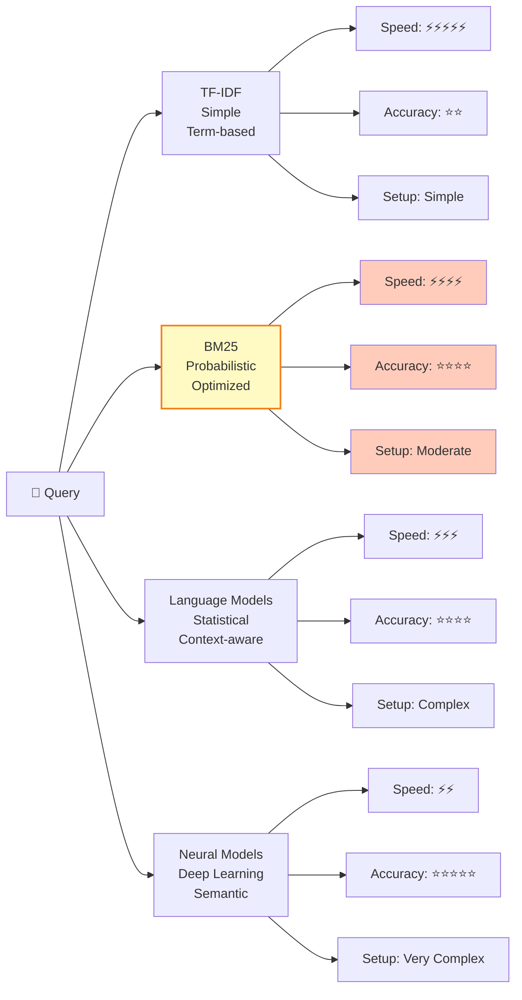

# BM25: Best Matching 25

## Origin of the Name

**BM25** stands for **"Best Matching 25"**, and the naming history reflects its development within the information retrieval research community:

### Historical Background

- **BM** = "Best Matching" - refers to the probabilistic model's goal of finding the best matching documents for a query
- **25** = The version number indicating this is the 25th iteration in the BM (Best Matching) family of ranking functions

### Evolution of the BM Series

The BM algorithm was developed by **Stephen E. Robertson and Karen Spärck Jones** at **City University London** in the 1970s as part of their groundbreaking work on probabilistic models for information retrieval. The algorithm family progressively evolved:

- **BM1, BM2, ... BM24** = Earlier iterations with various refinements to term weighting and document length normalization
- **BM25** = The 25th and most successful iteration, achieving near-optimal performance for practical IR systems
- **BM25+** = Later extensions that further improve upon the original BM25

### Why BM25 Became the Standard

BM25's designation as the "25th" version was somewhat arbitrary in numbering, but the algorithm itself became the de facto standard because:

1. **Optimal balance** - It provided the best trade-off between theoretical soundness and practical efficiency
2. **Proven effectiveness** - Superior performance over earlier BM versions (BM1-BM24)
3. **Wide adoption** - Became implemented in major search engines and IR systems (Google, Yahoo initially; now Elasticsearch, Solr, etc.)
4. **Research validation** - Extensively validated through TREC (Text Retrieval Conference) evaluations

Today, BM25 is often referenced simply as "BM25" without the '+' suffix for extensions, making it the most recognizable name in the ranking algorithm landscape.

---

## Overview

**BM25** (Best Matching 25) is a widely-used probabilistic ranking function used in information retrieval to estimate the relevance of indexed documents to a given search query. It is considered one of the most effective and efficient algorithms for indexing and searching text documents.

## Role in Indexing Work

BM25 serves as a **scoring algorithm** in indexing work that:

- **Ranks documents** based on how relevant they are to a search query
- **Evaluates term importance** by considering term frequency (TF) and inverse document frequency (IDF)
- **Normalizes document length** to prevent bias toward longer documents
- **Returns scored results** sorted by relevance, typically in descending order

### BM25 in Indexing Workflow

## Key Components

### 1. **Term Frequency (TF)**
Measures how often a query term appears in a document. More occurrences generally indicate higher relevance.

### 2. **Inverse Document Frequency (IDF)**
Measures how rare a term is across the entire document collection. Rare terms have higher discriminative power and contribute more to relevance scoring.

### 3. **Document Length Normalization**
Adjusts scores to account for document length, preventing long documents from unfairly dominating results.

### BM25 Components Interaction

## Mathematical Formula

$$\text{BM25}(D, Q) = \sum_{i=1}^{n} \text{IDF}(q_i) \cdot \frac{f(q_i, D) \cdot (k_1 + 1)}{f(q_i, D) + k_1 \cdot \left(1 - b + b \cdot \frac{|D|}{\text{avgdl}}\right)}$$

Where:
- **D** = document
- **Q** = query containing terms q₁, q₂, ..., qₙ
- **f(qᵢ, D)** = frequency of query term qᵢ in document D
- **|D|** = length of document D
- **avgdl** = average document length in the collection
- **k₁** = tuning parameter (typically 1.5) controlling term frequency saturation
- **b** = tuning parameter (typically 0.75) controlling document length normalization

## Advantages

✓ **Highly effective** - Produces relevant search results across diverse document types  
✓ **Efficient** - Fast computation suitable for large-scale indexing systems  
✓ **Flexible** - Tunable parameters (k₁, b) allow customization for specific use cases  
✓ **Well-tested** - Proven standard in search engines and IR systems  
✓ **Natural language friendly** - Works well with full-text search on natural language documents  

## Disadvantages

✗ **No semantic understanding** - Relies on surface-level term matching, not meaning  
✗ **Parameter sensitivity** - Performance depends on proper tuning of k₁ and b  
✗ **Term independence** - Ignores relationships between query terms  
✗ **Phrase queries** - Handles multi-word phrases less effectively than single terms  

## Common Applications

- **Full-text search engines** (Elasticsearch, Solr)
- **Web search systems** (historical ranking function)
- **Document retrieval systems**
- **E-commerce product search**
- **Information retrieval research**

### BM25 Applications Architecture

## BM25 vs. Other Methods

| Method | Characteristics |
|--------|-----------------|
| **BM25** | Probabilistic, term-based, efficient, widely adopted |
| **TF-IDF** | Simpler, doesn't account for term saturation |
| **Language Models** | Context-aware, computationally heavier |
| **Neural Models** | Deep semantic understanding, requires training data |

### Comparison of Ranking Methods

## Conclusion

BM25 remains the de facto standard for relevance ranking in full-text indexing systems. Its balance between effectiveness and efficiency makes it an essential component of modern information retrieval infrastructure. While newer deep learning approaches exist, BM25 continues to serve as a strong baseline and practical solution for production search systems.
