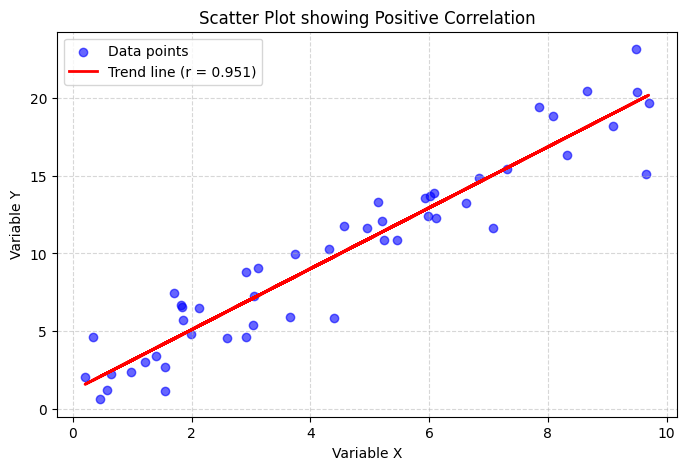
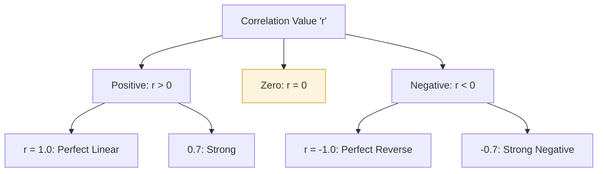
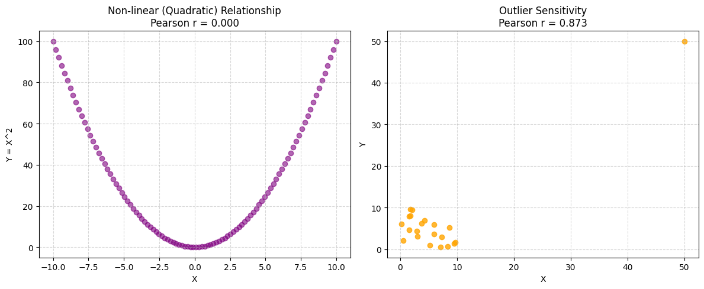
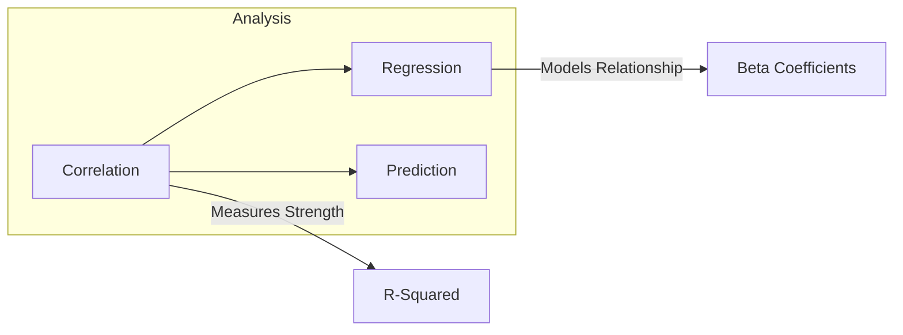

## Definition

The correlation coefficient is a numerical measure that describes the statistical relationship between two variables. While several types of correlation coefficients exist, the term most commonly refers to the **Pearson Product-Moment Correlation Coefficient** (Pearson's $r$). It measures how much two variables change together in a constant proportional way, representing the degree to which their relationship can be described by a straight line.

### Key Properties

- **Range**: The value of $r$ is always between $-1$ and $+1$ (inclusive).
- **Dimensionless**: It is a pure number without units, allowing for the comparison of relationships between variables measured in different scales.
- **Symmetry**: The correlation between $X$ and $Y$ is identical to the correlation between $Y$ and $X$.
- **Invariance**: It is not affected by linear transformations (adding, subtracting, or multiplying by a constant) of the data.

## Calculation

The Pearson correlation coefficient is calculated by dividing the covariance of the two variables by the product of their standard deviations. For two variables $X$ and $Y$ with $n$ data points:

$$r = \frac{\sum_{i=1}^{n} (X_i - \bar{X})(Y_i - \bar{Y})}{\sqrt{\sum_{i=1}^{n} (X_i - \bar{X})^2} \sqrt{\sum_{i=1}^{n} (Y_i - \bar{Y})^2}}$$

Alternatively, using covariance ($\text{cov}$) and standard deviation ($\sigma$):

$$r = \frac{\text{cov}(X, Y)}{\sigma_X \sigma_Y}$$

where:
- $\bar{X}, \bar{Y}$ are the sample means of $X$ and $Y$.
- $\sigma_X, \sigma_Y$ are the standard deviations.

* **Example**: If we observe that as the temperature ($X$) increases, ice cream sales ($Y$) also increase in a nearly linear fashion, the calculation will yield a positive $r$ close to $1$.

## Python Implementation

You can easily calculate the correlation coefficient and visualize it using Python libraries like `numpy` and `matplotlib`. The following code generates sample data, calculates Pearson's $r$, and plots a scatter plot with a trend line.

```python
import numpy as np
import matplotlib.pyplot as plt

# 1. Generate sample data
np.random.seed(42)
x = np.random.rand(50) * 10
# Create y with a strong positive correlation to x
y = 2 * x + 1 + np.random.randn(50) * 2

# 2. Calculate Pearson correlation coefficient
correlation_matrix = np.corrcoef(x, y)
r = correlation_matrix[0, 1]
print(f"Pearson Correlation Coefficient (r): {r:.3f}")

# 3. Visualize with a scatter plot and trend line
plt.figure(figsize=(8, 5))
plt.scatter(x, y, color='blue', alpha=0.6, label='Data points')

# Add a linear trend line
m, b = np.polyfit(x, y, 1)
plt.plot(x, m*x + b, color='red', linewidth=2, label=f'Trend line (r = {r:.3f})')

plt.title('Scatter Plot showing Positive Correlation')
plt.xlabel('Variable X')
plt.ylabel('Variable Y')
plt.legend()
plt.grid(True, linestyle='--', alpha=0.5)

# Display the plot
plt.show()
```



## Interpretation

The correlation coefficient provides a clear geometric and statistical meaning for the data:

* **$r = 1$**: Perfect positive linear relationship. Both variables move in the same direction.
* **$0.7 \leq r < 1$**: Strong positive correlation.
* **$0.3 \leq r < 0.7$**: Moderate positive correlation.
* **$r = 0$**: No linear relationship. The variables do not show a consistent linear pattern (though they might have a non-linear one).
* **$-1 < r \leq -0.7$**: Strong negative correlation. As one variable increases, the other decreases.
* **$r = -1$**: Perfect negative linear relationship.

**Crucial Note**: "Correlation does not imply causation." A high correlation coefficient simply indicates that two variables move together, not that one causes the other.



## Necessity

Correlation analysis is fundamental across various disciplines:

- **Data Science and ML**: Used for **Feature Selection** to identify variables that are strongly related to the target variable or to detect **Multicollinearity** (redundant features).
- **Finance**: Portfolio managers use correlation to diversify assets. Combining assets with low or negative correlation reduces overall portfolio risk.
- **Medicine and Biology**: Researchers use it to find relationships between lifestyle factors (e.g., smoking) and health outcomes (e.g., lung capacity).
- **Quality Control**: In manufacturing, it helps identify which process parameters most significantly affect the quality of the final product.

## Limitations and Alternatives

Despite its utility, Pearson's $r$ has specific limitations:

- **Linearity Only**: It only detects linear relationships. A perfect U-shaped (quadratic) relationship might result in $r = 0$.
- **Outlier Sensitivity**: A single extreme outlier can significantly inflate or deflate the coefficient, leading to misleading conclusions.
- **Anscombe's Quartet**: Different data distributions can result in the same correlation coefficient, emphasizing the need to visualize data using scatter plots.

### Python Implementation: Limitations

The following Python code demonstrates two major limitations of Pearson's $r$: its inability to capture non-linear relationships (yielding $r \approx 0$ for a perfect quadratic curve) and its extreme sensitivity to a single outlier.

```python
import numpy as np
import matplotlib.pyplot as plt

fig, (ax1, ax2) = plt.subplots(1, 2, figsize=(12, 5))

# 1. Limitation: Linearity Only (Perfect U-shaped relationship)
x1 = np.linspace(-10, 10, 100)
y1 = x1**2  # Perfect quadratic relationship
r1 = np.corrcoef(x1, y1)[0, 1]

ax1.scatter(x1, y1, color='purple', alpha=0.6)
ax1.set_title(f"Non-linear (Quadratic) Relationship\nPearson r = {r1:.3f}")
ax1.set_xlabel("X")
ax1.set_ylabel("Y = X^2")
ax1.grid(True, linestyle='--', alpha=0.5)

# 2. Limitation: Outlier Sensitivity
np.random.seed(42)
x2 = np.random.rand(20) * 10
y2 = np.random.rand(20) * 10  # Random data with no real correlation
# Add one extreme outlier
x2 = np.append(x2, 50)
y2 = np.append(y2, 50)
r2 = np.corrcoef(x2, y2)[0, 1]

ax2.scatter(x2, y2, color='orange', alpha=0.8)
ax2.set_title(f"Outlier Sensitivity\nPearson r = {r2:.3f}")
ax2.set_xlabel("X")
ax2.set_ylabel("Y")
ax2.grid(True, linestyle='--', alpha=0.5)

plt.tight_layout()
plt.show()
```




### Alternatives

- **Spearman’s Rank Correlation ($\rho$)**: A non-parametric measure that uses the rank of data points. It detects monotonic relationships (not just linear) and is more robust to outliers.
- **Kendall’s Tau ($\tau$)**: Another rank-based measure, often preferred for small datasets with many tied ranks.
- **Mutual Information**: A concept from information theory that measures any kind of dependency (linear or non-linear) between variables.
- **Distance Correlation**: A measure of dependence that is zero if and only if the variables are independent, capable of detecting non-linear associations.

## Derived Subsequent Concepts

Correlation serves as a building block for advanced statistical modeling:

- **Coefficient of Determination ($R^2$)**: The square of the correlation coefficient. It represents the proportion of variance in the dependent variable that is predictable from the independent variable.
- **Regression Analysis**: Correlation is the foundation of simple linear regression, where the goal is to model the relationship $Y = \beta_0 + \beta_1 X + \epsilon$.



- **Partial Correlation**: Measures the relationship between two variables while controlling for the effect of one or more additional variables.
- **Autocorrelation**: The correlation of a signal with a delayed version of itself, used extensively in time-series analysis to find repeating patterns.
- **Correlation Matrix**: A table showing correlation coefficients between many variables, essential for Exploratory Data Analysis (EDA).
