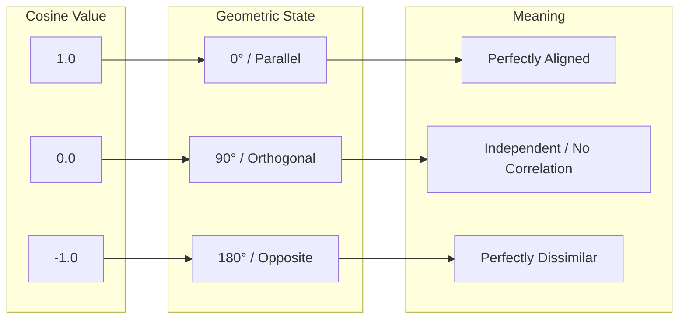
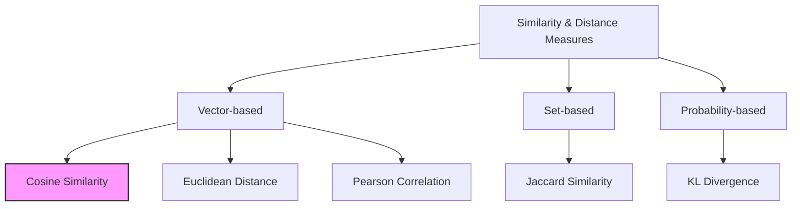
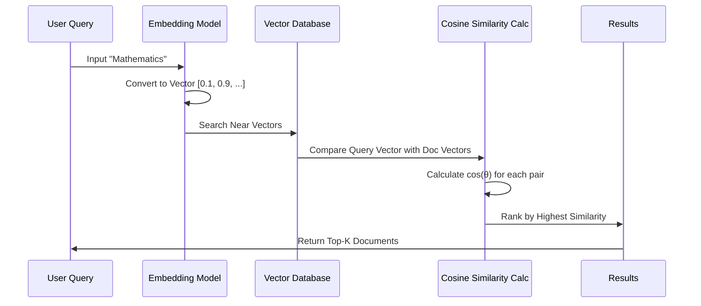

## Definition

Cosine similarity is a metric used to measure how similar two vectors are in an inner product space, regardless of their size. It calculates the cosine of the angle between two non-zero vectors. Because it measures the orientation rather than the magnitude, it is particularly effective for comparing documents or data points where the absolute values may vary significantly, but the relative proportions of components are similar.

### Key Properties

Cosine similarity possesses several fundamental characteristics:

- **Range**: The value ranges from $-1$ to $1$.
- **Magnitude Independence**: The similarity score remains the same even if the vectors are scaled, as long as their direction remains unchanged.
- **Symmetry**: $\text{sim}(\mathbf{u}, \mathbf{v}) = \text{sim}(\mathbf{v}, \mathbf{u})$; the order of the vectors does not affect the result.

## Calculation

Cosine similarity is calculated by taking the dot product of two vectors and dividing it by the product of their Euclidean (L2) norms. For two vectors $\mathbf{u}$ and $\mathbf{v}$, the formula is:

$$\text{cosine similarity} = \cos(\theta) = \frac{\mathbf{u} \cdot \mathbf{v}}{\|\mathbf{u}\|_2 \|\mathbf{v}\|_2} = \frac{\sum_{i=1}^{n} u_i v_i}{\sqrt{\sum_{i=1}^{n} u_i^2} \sqrt{\sum_{i=1}^{n} v_i^2}}$$

where:
- $\mathbf{u} \cdot \mathbf{v}$ is the dot product of the vectors.
- $\|\mathbf{u}\|_2$ and $\|\mathbf{v}\|_2$ are the L2 norms (magnitudes) of vectors $\mathbf{u}$ and $\mathbf{v}$, respectively.
- $\theta$ is the angle between the two vectors.

* **Example**: Given vectors $\mathbf{u} = (3, 2, 0)$ and $\mathbf{v} = (5, 2, 0)$:
  - Dot product: $3 \times 5 + 2 \times 2 + 0 \times 0 = 15 + 4 = 19$
  - $\|\mathbf{u}\|_2$: $\sqrt{3^2 + 2^2 + 0^2} = \sqrt{13} \approx 3.605$
  - $\|\mathbf{v}\|_2$: $\sqrt{5^2 + 2^2 + 0^2} = \sqrt{29} \approx 5.385$
  - Cosine similarity: $\frac{19}{3.605 \times 5.385} \approx \frac{19}{19.41} \approx 0.979$ (indicates high similarity).

## Interpretation

The resulting value provides a geometric interpretation of the relationship between vectors:

* **Close to 1**: $\theta \approx 0^\circ$; the vectors point in nearly the same direction, indicating very high similarity.
* **Close to 0**: $\theta \approx 90^\circ$; the vectors are orthogonal (perpendicular), indicating no correlation or independence.
* **Close to -1**: $\theta \approx 180^\circ$; the vectors point in diametrically opposite directions, indicating strong dissimilarity. (Note: In many applications like text mining where values are non-negative, the range is typically $[0, 1]$).

## Necessity

Cosine similarity is indispensable in various domains for the following reasons:

- **Natural Language Processing (NLP)**: Used to measure semantic similarity between word embeddings or document vectors (e.g., TF-IDF). It allows comparing documents of different lengths based on content similarity rather than word count.
- **Recommendation Systems**: Identifies users with similar tastes or items with similar attributes by representing them as vectors in a high-dimensional space.
- **High-Dimensional Data Analysis**: Unlike Euclidean distance, which can suffer from the "curse of dimensionality," cosine similarity remains more robust as a measure of relative orientation in sparse, high-dimensional spaces.
- **Computer Vision**: Utilized to compare feature vectors extracted from images to identify visual similarities.

## Limitations and Alternatives

While powerful, cosine similarity has certain drawbacks:

- **Ignoring Magnitude**: It does not account for the absolute size of the vectors. For example, two users who rate movies in the same pattern but at different frequency levels will have a similarity of 1.
- **Sensitivity to Centering**: Without proper normalization or centering (e.g., subtracting the mean), the similarity values can be biased by the distribution of the data.

### Alternatives

- **Euclidean Distance**: Measures the physical distance between points. Suitable when the magnitude or scale of the data is critical.
- **Pearson Correlation Coefficient**: Similar to cosine similarity but subtracts the mean from each component first. This accounts for user bias (e.g., "tough" vs. "generous" raters).
- **Jaccard Similarity**: Best for binary or set-based data, measuring the ratio of the intersection to the union of two sets.
- **Manhattan Distance**: Sums the absolute differences across dimensions; computationally simpler but less focused on geometric orientation.

## Derived Subsequent Concepts

Several advanced concepts have evolved from cosine similarity:

- **Cosine Distance**: Defined as $1 - \text{cosine similarity}$. It maps similarity into a range of 0 to 2, providing a useful distance measure (or pseudo-distance metric).
- **Angular Distance**: Uses the actual angle $\theta = \arccos(\text{cosine similarity})$ as a distance metric. When normalized, it satisfies all properties of a proper distance metric, including the triangle inequality.
- **Soft Cosine Measure**: An extension that considers the internal similarity between features (dimensions) rather than assuming they are all independent.
- **Contrastive Learning**: A deep learning paradigm where models are trained to maximize the cosine similarity between related data pairs and minimize it for unrelated ones (e.g., SimCLR, CLIP).

