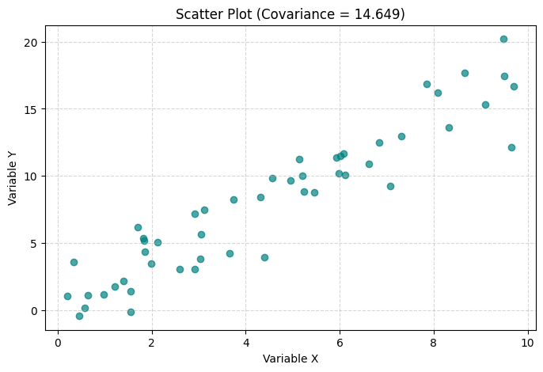
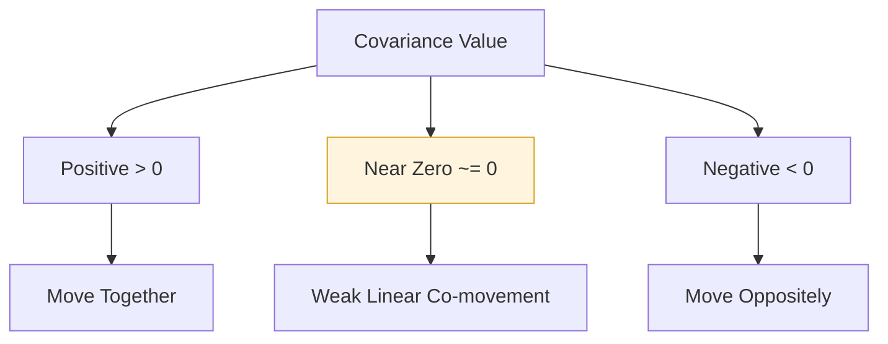
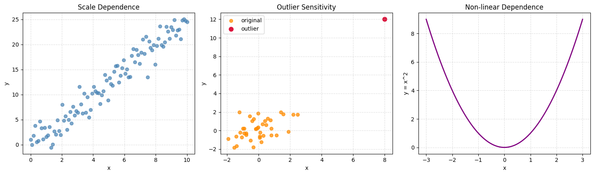
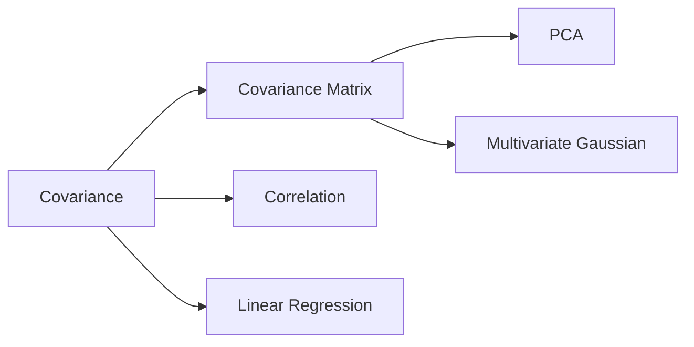

## Definition

Covariance is a measure of **joint variability** between two variables.
It asks a simple question: when one variable is above (or below) its mean, does the other variable also tend to be above (or below) its mean?

To answer this, covariance uses the product of centered values:

- If $(X-\mu_X)$ and $(Y-\mu_Y)$ are often both positive or both negative, their product is positive, and covariance becomes positive.
- If one is usually positive while the other is negative, their product is negative, and covariance becomes negative.
- If positive and negative products mostly cancel out, covariance is near zero.

So covariance mainly captures the **direction of linear co-movement** rather than a standardized strength score.

For random variables $X$ and $Y$:

$$\operatorname{Cov}(X, Y) = \mathbb{E}[(X - \mu_X)(Y - \mu_Y)]$$

For sample data:

$$s_{XY} = \frac{1}{n-1}\sum_{i=1}^{n}(X_i-\bar{X})(Y_i-\bar{Y})$$

Here, $\mu_X, \mu_Y$ are population means, while $\bar{X}, \bar{Y}$ are sample means.
The sample version is used in practice because population parameters are usually unknown.

### Key Properties

- **Sign indicates direction**: Positive means same-direction movement, negative means opposite-direction movement.
- **Symmetry**: $\operatorname{Cov}(X, Y) = \operatorname{Cov}(Y, X)$.
- **Units depend on variables**: The unit is the product of the units of $X$ and $Y$ (e.g., meter*second).
- **Not normalized**: Magnitude is scale-dependent, so direct comparisons across datasets are often misleading.
- **Variance relation**: $\operatorname{Cov}(X, X) = \operatorname{Var}(X)$.
- **Independence implication**: If $X$ and $Y$ are independent, covariance is zero (the reverse is not always true).

## Calculation

For population covariance:

$$\operatorname{Cov}(X, Y) = \frac{1}{N}\sum_{i=1}^{N}(X_i-\mu_X)(Y_i-\mu_Y)$$

For sample covariance:

$$s_{XY} = \frac{1}{n-1}\sum_{i=1}^{n}(X_i-\bar{X})(Y_i-\bar{Y})$$

The denominator $n-1$ (Bessel's correction) is used to reduce bias in sample-based estimation.

To compute sample covariance step by step:

1. Compute each variable mean: $\bar{X}$ and $\bar{Y}$.
2. Subtract means to get centered values.
3. Multiply paired centered values and sum them.
4. Divide by $n-1$.

Numerical example with three observations:

- $X = [1, 2, 3]$, $\bar{X}=2$
- $Y = [2, 4, 6]$, $\bar{Y}=4$

$$
s_{XY} = \frac{(1-2)(2-4) + (2-2)(4-4) + (3-2)(6-4)}{3-1}
= \frac{2 + 0 + 2}{2}
= 2
$$

The positive covariance means $X$ and $Y$ increase together on average.

## Python Implementation

```python
import numpy as np
import matplotlib.pyplot as plt

# 1. Sample data
np.random.seed(42)
x = np.random.rand(50) * 10
y = 1.8 * x + np.random.randn(50) * 2

# 2. Compute sample covariance
cov_matrix = np.cov(x, y, ddof=1)
cov_xy = cov_matrix[0, 1]
print(f"Sample Covariance: {cov_xy:.3f}")

# 3. Visualize
plt.figure(figsize=(8, 5))
plt.scatter(x, y, alpha=0.7, color="teal")
plt.title(f"Scatter Plot (Covariance = {cov_xy:.3f})")
plt.xlabel("Variable X")
plt.ylabel("Variable Y")
plt.grid(True, linestyle="--", alpha=0.5)
plt.show()
```



## Interpretation

- **$\operatorname{Cov}(X,Y) > 0$**: Variables tend to move together.
- **$\operatorname{Cov}(X,Y) < 0$**: Variables tend to move in opposite directions.
- **$\operatorname{Cov}(X,Y) \approx 0$**: No clear linear co-movement.

Covariance tells direction, not standardized strength.  
For comparing relationship strength, use correlation:

$$\rho_{XY} = \frac{\operatorname{Cov}(X,Y)}{\sigma_X \sigma_Y}$$

Practical interpretation note:

- A covariance of `50` can be "large" in one problem and "small" in another, because scale and units change the value directly.
- This is why covariance is often used inside models (matrix computations), while correlation is used for human comparison and reporting.



## Necessity

Covariance is a foundational concept in statistics and machine learning:

- **Portfolio Theory**: Used in risk modeling through covariance matrices of asset returns.
- **Multivariate Analysis**: Core component of covariance matrices, PCA, and Gaussian models.
- **Signal Processing**: Helps model joint variability across channels.
- **Feature Engineering**: Useful for understanding co-movement patterns between features.
- **Risk Decomposition**: Portfolio variance uses covariance terms to explain how each asset pair contributes to total risk.

## Limitations and Alternatives

### Limitations

- **Scale-dependent**: Value changes with units and variable scaling.
- **Outlier-sensitive**: Extreme observations can heavily affect the result.
- **Linear focus**: It does not capture complex non-linear dependencies well.
- **Zero covariance is not independence**: Non-linear dependence can exist even when covariance is near zero.

### Python Implementation: Limitations Check

The following code demonstrates three common pitfalls:

1. Scale dependence: multiplying one variable by a constant scales covariance.
2. Outlier sensitivity: one extreme point can dramatically change covariance.
3. Non-linear dependence: strong dependency can exist with near-zero covariance.

```python
import numpy as np
import matplotlib.pyplot as plt

np.random.seed(42)
fig, (ax1, ax2, ax3) = plt.subplots(1, 3, figsize=(15, 4.5))

# 1) Scale dependence
x1 = np.linspace(0, 10, 100)
y1 = 2.5 * x1 + np.random.randn(100) * 2
cov_original = np.cov(x1, y1, ddof=1)[0, 1]
cov_scaled = np.cov(100 * x1, y1, ddof=1)[0, 1]
corr_same = np.corrcoef(x1, y1)[0, 1]
print(f"[Scale] cov(x,y)={cov_original:.3f}, cov(100x,y)={cov_scaled:.3f}, corr={corr_same:.3f}")

ax1.scatter(x1, y1, alpha=0.7, color="steelblue")
ax1.set_title("Scale Dependence")
ax1.set_xlabel("x")
ax1.set_ylabel("y")
ax1.grid(True, linestyle="--", alpha=0.4)

# 2) Outlier sensitivity
x2 = np.random.normal(0, 1, 40)
y2 = 0.6 * x2 + np.random.normal(0, 1, 40)
cov_before = np.cov(x2, y2, ddof=1)[0, 1]
x2_out = np.append(x2, 8)
y2_out = np.append(y2, 12)
cov_after = np.cov(x2_out, y2_out, ddof=1)[0, 1]
print(f"[Outlier] cov(before)={cov_before:.3f}, cov(after)={cov_after:.3f}")

ax2.scatter(x2, y2, alpha=0.75, color="darkorange", label="original")
ax2.scatter([8], [12], color="crimson", s=60, label="outlier")
ax2.set_title("Outlier Sensitivity")
ax2.set_xlabel("x")
ax2.set_ylabel("y")
ax2.legend()
ax2.grid(True, linestyle="--", alpha=0.4)

# 3) Non-linear dependence with near-zero covariance
x3 = np.linspace(-3, 3, 200)
y3 = x3**2
cov_nonlinear = np.cov(x3, y3, ddof=1)[0, 1]
print(f"[Non-linear] cov(x, x^2)={cov_nonlinear:.6f}")

ax3.plot(x3, y3, color="purple", linewidth=2)
ax3.set_title("Non-linear Dependence")
ax3.set_xlabel("x")
ax3.set_ylabel("y = x^2")
ax3.grid(True, linestyle="--", alpha=0.4)

plt.tight_layout()
plt.show()
```


Expected takeaway:

- `cov(100x, y)` becomes about 100 times larger than `cov(x, y)` even though the relationship pattern is the same.
- Adding a single outlier can greatly inflate or deflate covariance.
- `cov(x, x^2)` can be near zero although $y=x^2$ is clearly dependent on $x$.

### Alternatives

- **Correlation Coefficient**: Standardized covariance for cross-scale comparison.
- **Spearman’s Rank Correlation**: Rank-based, more robust for monotonic non-linear trends.
- **Kendall’s Tau**: Rank-based and robust for small samples with ties.
- **Mutual Information**: Detects broader (including non-linear) dependencies.

## Derived Subsequent Concepts

Covariance directly supports many downstream methods:

- **Covariance Matrix ($\Sigma$)**: Stores pairwise covariances among multiple variables.
- **Principal Component Analysis (PCA)**: Uses eigenvectors/eigenvalues of covariance matrix.
- **Multivariate Normal Distribution**: Covariance matrix defines spread and orientation.
- **Linear Regression**: Slope in simple regression relates to covariance:

$$\beta_1 = \frac{\operatorname{Cov}(X,Y)}{\operatorname{Var}(X)}$$

- **Mahalanobis Distance**: Uses inverse covariance matrix to measure distance with feature correlation and scale considered.


