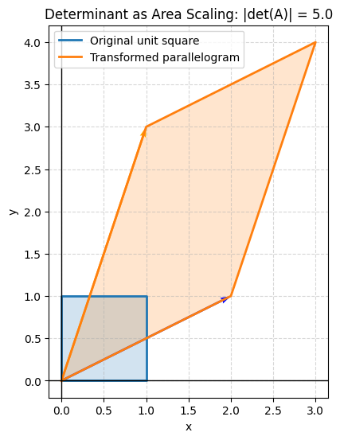
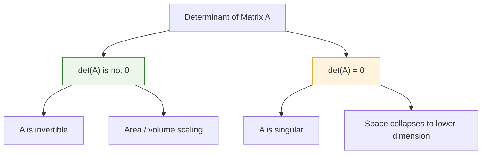
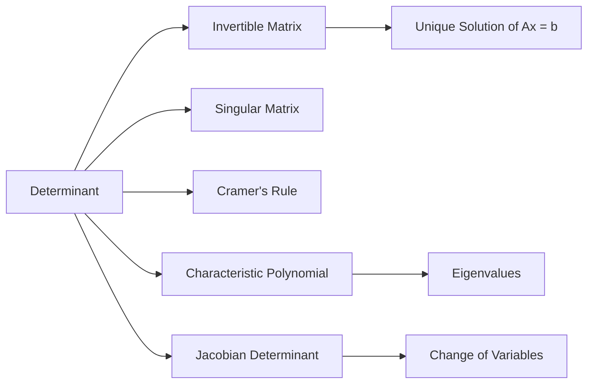

## Definition

The **determinant** of a square matrix is a scalar value that summarizes important geometric and algebraic properties of the matrix. It is usually written as $\det(A)$ or $|A|$ for a square matrix $A$.

For a matrix representing a linear transformation, the determinant describes how the transformation scales area, volume, or higher-dimensional volume. It also indicates whether the transformation preserves or reverses orientation.

For example, if $A$ is a $2 \times 2$ matrix, then $|\det(A)|$ gives the area-scaling factor of the transformation represented by $A$.

### Key Properties

- **Square Matrix Only**: The determinant is defined only for square matrices.
- **Scalar Output**: A determinant is a single number, not a matrix.
- **Invertibility Test**: A square matrix $A$ is invertible if and only if $\det(A) \neq 0$.
- **Geometric Scaling**: The absolute value $|\det(A)|$ gives the scaling factor for area, volume, or hypervolume.
- **Orientation**: A positive determinant preserves orientation, while a negative determinant reverses orientation.
- **Zero Determinant**: If $\det(A)=0$, the transformation collapses space into a lower dimension.

## Calculation

For a $2 \times 2$ matrix:

$$
A = \begin{bmatrix}
a & b \\
c & d
\end{bmatrix}
$$

The determinant is:

$$
\det(A) = ad - bc
$$

* **Example**:

$$
A = \begin{bmatrix}
3 & 2 \\
1 & 4
\end{bmatrix}
$$

Then:

$$
\det(A) = (3)(4) - (2)(1) = 12 - 2 = 10
$$

Since $\det(A)=10 \neq 0$, the matrix is invertible. Geometrically, the linear transformation represented by $A$ scales area by a factor of $10$.

For a $3 \times 3$ matrix:

$$
A = \begin{bmatrix}
a & b & c \\
d & e & f \\
g & h & i
\end{bmatrix}
$$

The determinant is:

$$
\det(A) = a(ei - fh) - b(di - fg) + c(dh - eg)
$$

This formula can be understood as **cofactor expansion** along the first row.

## Python Implementation

You can calculate the determinant of a matrix using `numpy.linalg.det`. The following code calculates the determinant of a $2 \times 2$ matrix and checks whether the matrix is invertible.

```python
import numpy as np

# 1. Define a square matrix
A = np.array([
    [3, 2],
    [1, 4]
])

# 2. Calculate the determinant
det_A = np.linalg.det(A)

# 3. Check invertibility
is_invertible = not np.isclose(det_A, 0)

print(f"Matrix A:\n{A}")
print(f"det(A): {det_A:.2f}")
print(f"Is A invertible? {is_invertible}")
```

Expected output:

```text
Matrix A:
[[3 2]
 [1 4]]
det(A): 10.00
Is A invertible? True
```

### Python Implementation: Visualization

The following code visualizes the geometric meaning of the determinant. The unit square is transformed by a matrix $A$. The original square has area $1$, while the transformed parallelogram has area $|\det(A)|$.

```python
import numpy as np
import matplotlib.pyplot as plt

# 1. Define a 2x2 matrix
A = np.array([
    [2, 1],
    [1, 3]
])

det_A = np.linalg.det(A)

# 2. Define the unit square vertices
unit_square = np.array([
    [0, 0],
    [1, 0],
    [1, 1],
    [0, 1],
    [0, 0]
])

# 3. Transform the unit square
transformed_square = unit_square @ A.T

# 4. Plot both shapes
fig, ax = plt.subplots(figsize=(8, 6))

ax.plot(unit_square[:, 0], unit_square[:, 1], linewidth=2, label="Original unit square")
ax.fill(unit_square[:, 0], unit_square[:, 1], alpha=0.2)

ax.plot(transformed_square[:, 0], transformed_square[:, 1], linewidth=2, label="Transformed parallelogram")
ax.fill(transformed_square[:, 0], transformed_square[:, 1], alpha=0.2)

# Show transformed basis vectors
# Fix: Provide an origin for every vector being plotted
origin_x = [0, 0]
origin_y = [0, 0]
basis_vectors = A.T

ax.quiver(
    origin_x, origin_y,
    basis_vectors[:, 0], basis_vectors[:, 1],
    angles="xy", scale_units="xy", scale=1, color=['blue', 'orange']
)

ax.set_title(f"Determinant as Area Scaling: |det(A)| = {abs(det_A):.1f}")
ax.set_xlabel("x")
ax.set_ylabel("y")
ax.axhline(0, color='black', linewidth=1)
ax.axvline(0, color='black', linewidth=1)
ax.set_aspect("equal", adjustable="box")
ax.grid(True, linestyle="--", alpha=0.5)
ax.legend()

# Prevent axis labels and title from being clipped
fig.subplots_adjust(left=0.10, right=0.96, bottom=0.12, top=0.90)

plt.show()
```



## Interpretation

The determinant has several important meanings depending on context:

* **Algebraic Meaning**: The determinant indicates whether a square matrix is invertible. If $\det(A)=0$, the matrix has no inverse.
* **Geometric Meaning**: The determinant measures how much a linear transformation scales area or volume.
* **Orientation Meaning**: A positive determinant preserves orientation, while a negative determinant reverses orientation.
* **Linear Dependence Meaning**: If the determinant is zero, the rows or columns of the matrix are linearly dependent.



## Necessity

The determinant is essential in many areas of mathematics, science, and engineering:

- **Linear Algebra**: Used to determine invertibility, singularity, rank relationships, and linear dependence.
- **Systems of Linear Equations**: A nonzero determinant guarantees a unique solution for a square linear system.
- **Geometry**: Used to compute area, volume, orientation, and transformations.
- **Calculus**: Appears in the Jacobian determinant for change of variables in multiple integrals.
- **Eigenvalue Problems**: Used in characteristic equations such as $\det(A - \lambda I)=0$.
- **Computer Graphics**: Helps describe transformations such as scaling, reflection, rotation, and projection.
- **Numerical Computation**: Used indirectly in matrix factorization, stability analysis, and solving systems.

## Limitations and Alternatives

Although determinants are powerful, they are not always the best computational tool.

- **Numerical Instability**: Direct determinant computation can be sensitive to floating-point errors for large or ill-conditioned matrices.
- **Computational Cost**: Cofactor expansion becomes extremely inefficient as matrix size increases.
- **Poor Diagnostic Alone**: A determinant close to zero may indicate near-singularity, but it does not fully describe numerical conditioning.
- **Scale Sensitivity**: Large matrices can have very large or very small determinants, making direct interpretation difficult.

### Alternatives and Related Tools

- **Matrix Rank**: Determines the dimension of the column space or row space and identifies linear dependence.
- **LU Decomposition**: Efficiently computes determinants and solves linear systems.
- **Singular Value Decomposition (SVD)**: Gives more stable information about matrix conditioning and rank.
- **Condition Number**: Measures how sensitive a matrix problem is to numerical error.
- **Eigenvalues**: The determinant equals the product of eigenvalues, counting algebraic multiplicity.

## Derived Subsequent Concepts

The determinant serves as a foundation for many later concepts in linear algebra and calculus:

- **Invertible Matrix**: A square matrix with nonzero determinant.
- **Singular Matrix**: A square matrix with determinant zero.
- **Cramer's Rule**: A formula for solving linear systems using determinants.
- **Characteristic Polynomial**: Defined using $\det(A - \lambda I)$.
- **Eigenvalues**: Values of $\lambda$ satisfying $\det(A - \lambda I)=0$.
- **Jacobian Determinant**: Measures local area or volume scaling in multivariable calculus.
- **Change of Variables Formula**: Uses the absolute value of the Jacobian determinant.



## Related Concepts

- **Matrix**: A rectangular array of numbers or symbols.
- **Square Matrix**: A matrix with the same number of rows and columns.
- **Inverse Matrix**: A matrix $A^{-1}$ such that $AA^{-1}=I$.
- **Linear Transformation**: A function that preserves vector addition and scalar multiplication.
- **Basis Vectors**: Vectors that span a vector space and define coordinates.
- **Eigenvalue**: A scalar describing how a matrix stretches a vector without changing its direction.
- **Jacobian Matrix**: A matrix of first-order partial derivatives.
