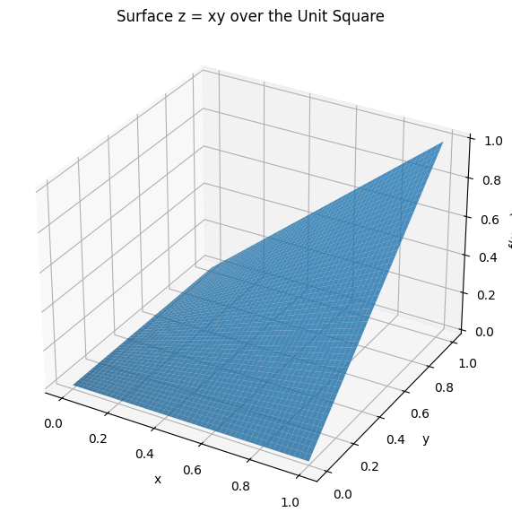
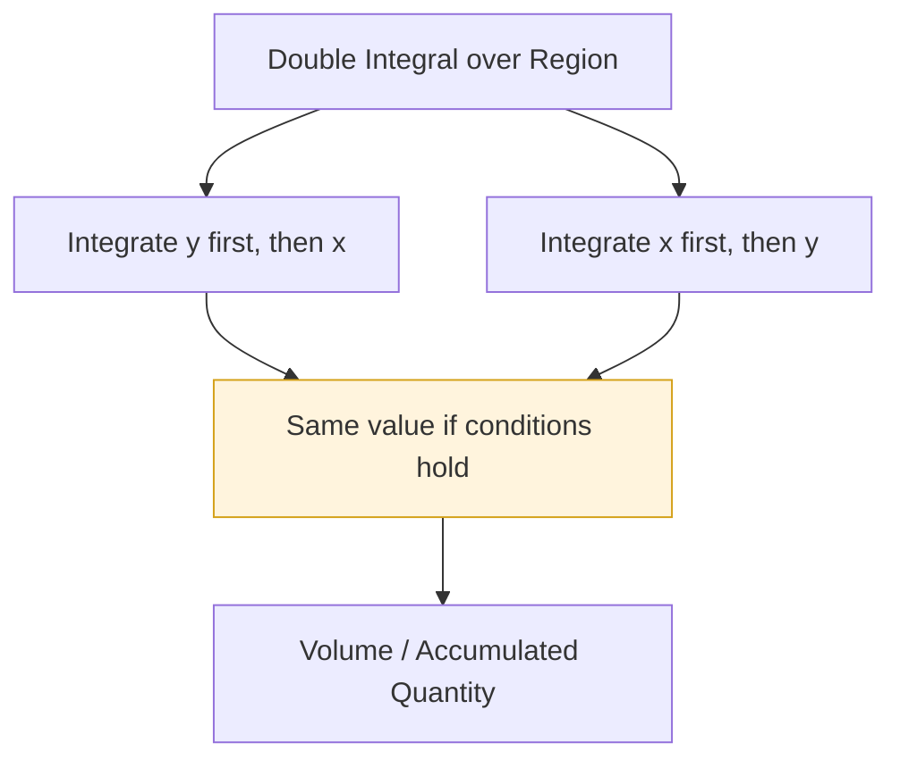
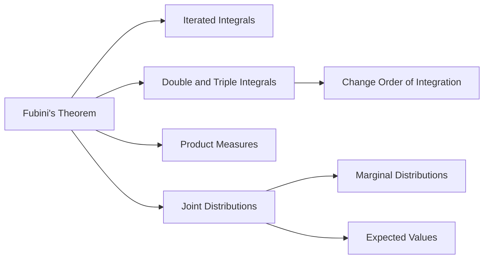

## Definition

**Fubini's Theorem** states that, under suitable conditions, the integral of a function over a product space can be computed as an **iterated integral**. In practical terms, it allows a double integral to be evaluated by integrating one variable first and then the other.

For a function $f(x, y)$ defined on a rectangular region $A \times B$, Fubini's Theorem gives a rigorous justification for writing:

$$
\int_{A \times B} f(x, y)\, d(x,y)
= \int_A \left( \int_B f(x, y)\, dy \right) dx
= \int_B \left( \int_A f(x, y)\, dx \right) dy
$$

In elementary multivariable calculus, this is often written as:

$$
\iint_R f(x,y)\, dA
= \int_a^b \int_c^d f(x,y)\, dy\, dx
= \int_c^d \int_a^b f(x,y)\, dx\, dy
$$

where $R = [a,b] \times [c,d]$.

### Key Properties

- **Order Switching**: Under the theorem's conditions, the order of integration may be changed.
- **Product Space Integration**: It applies naturally to spaces formed as Cartesian products, such as $A \times B$.
- **Iterated Integral Justification**: It explains why a multiple integral can be computed one variable at a time.
- **Condition Dependent**: The theorem requires integrability assumptions; the order of integration cannot always be changed freely.

## Calculation

For a continuous function $f(x,y)$ on a rectangular region $R = [a,b] \times [c,d]$, Fubini's Theorem allows the double integral to be calculated in either order:

$$
\iint_R f(x,y)\, dA
= \int_a^b \int_c^d f(x,y)\, dy\, dx
$$

or equivalently:

$$
\iint_R f(x,y)\, dA
= \int_c^d \int_a^b f(x,y)\, dx\, dy
$$

where:
- $R$ is the region of integration.
- $f(x,y)$ is the function being integrated.
- $dA$ represents an area element.
- The inner integral is evaluated first.

* **Example**: Evaluate the integral of $f(x,y)=xy$ over the unit square $[0,1] \times [0,1]$.

Using the order $dy\,dx$:

$$
\int_0^1 \int_0^1 xy\, dy\, dx
= \int_0^1 x \left[ \frac{y^2}{2} \right]_0^1 dx
= \int_0^1 \frac{x}{2}\, dx
= \left[ \frac{x^2}{4} \right]_0^1
= \frac{1}{4}
$$

Using the order $dx\,dy$:

$$
\int_0^1 \int_0^1 xy\, dx\, dy
= \int_0^1 y \left[ \frac{x^2}{2} \right]_0^1 dy
= \int_0^1 \frac{y}{2}\, dy
= \left[ \frac{y^2}{4} \right]_0^1
= \frac{1}{4}
$$

Both orders produce the same value.

## Python Implementation

You can verify Fubini's Theorem symbolically using Python's `sympy` library. The following code calculates the integral of $f(x,y)=xy$ over the unit square in both possible orders.

```python
import sympy as sp

# 1. Define symbols
x, y = sp.symbols('x y')

# 2. Define the function
f = x * y

# 3. Integrate in the order dy dx
integral_y_then_x = sp.integrate(
    sp.integrate(f, (y, 0, 1)),
    (x, 0, 1)
)

# 4. Integrate in the order dx dy
integral_x_then_y = sp.integrate(
    sp.integrate(f, (x, 0, 1)),
    (y, 0, 1)
)

print("Integral in order dy dx:", integral_y_then_x)
print("Integral in order dx dy:", integral_x_then_y)
print("Are they equal?", integral_y_then_x == integral_x_then_y)
```

Expected output:

```text
Integral in order dy dx: 1/4
Integral in order dx dy: 1/4
Are they equal? True
```

### Python Implementation: Visualization

The following code visualizes the surface $z = xy$ over the unit square. The double integral represents the volume under this surface above the region $[0,1] \times [0,1]$.

```python
import numpy as np
import matplotlib.pyplot as plt

# 1. Generate grid values
x = np.linspace(0, 1, 50)
y = np.linspace(0, 1, 50)
X, Y = np.meshgrid(x, y)
Z = X * Y

# 2. Create a 3D surface plot
fig = plt.figure(figsize=(8, 6))
ax = fig.add_subplot(111, projection='3d')

ax.plot_surface(X, Y, Z, alpha=0.8)

ax.set_title("Surface z = xy over the Unit Square")
ax.set_xlabel("x")
ax.set_ylabel("y")
ax.set_zlabel("f(x, y)")

plt.show()
```



## Interpretation

Fubini's Theorem provides a bridge between **geometric intuition** and **rigorous integration theory**.

* **Geometric Meaning**: A double integral can be interpreted as accumulating thin slices of volume. Integrating first with respect to $y$ slices the region in one direction, while integrating first with respect to $x$ slices it in the other direction.
* **Computational Meaning**: It allows the easier order of integration to be chosen, reducing algebraic difficulty.
* **Theoretical Meaning**: It gives the conditions under which integration over product spaces is equivalent to repeated one-dimensional integration.



## Necessity

Fubini's Theorem is essential in many areas of mathematics, science, and engineering:

- **Multivariable Calculus**: Used to evaluate double and triple integrals efficiently.
- **Probability Theory**: Justifies integrating joint probability density functions one variable at a time.
- **Statistics**: Supports calculations involving marginal distributions and expected values.
- **Physics and Engineering**: Used to compute mass, center of mass, electric charge, fluid flow, and other accumulated quantities over regions.
- **Measure Theory**: Provides the rigorous foundation for integration over product measure spaces.

## Limitations and Alternatives

Fubini's Theorem is powerful, but it does not apply without conditions.

- **Integrability Requirement**: The function generally must be integrable over the product space.
- **Absolute Integrability**: A common sufficient condition is that $\int |f|$ is finite.
- **Improper Integral Caution**: For improper integrals, changing the order can produce incorrect or different results if the function is not absolutely integrable.
- **Conditional Convergence**: Some functions may produce different values depending on the order of integration when the assumptions fail.

### Tonelli's Theorem

A closely related result is **Tonelli's Theorem**. It applies to nonnegative measurable functions and permits changing the order of integration even when the integral may be infinite.

In simplified form:

$$
\int_{A \times B} f(x,y)\, d(x,y)
= \int_A \int_B f(x,y)\, dy\, dx
= \int_B \int_A f(x,y)\, dx\, dy
$$

when $f(x,y) \geq 0$.

### Comparison with Tonelli's Theorem

| Theorem | Main Condition | Main Use |
|---|---|---|
| Fubini's Theorem | Function is integrable, often absolutely integrable | Swap integration order and guarantee finite equality |
| Tonelli's Theorem | Function is nonnegative and measurable | Swap integration order even when the value may be infinite |

## Derived Subsequent Concepts

Fubini's Theorem is a foundation for several advanced ideas:

- **Iterated Integrals**: Integrals computed one variable at a time.
- **Double and Triple Integrals**: Integration over two-dimensional or three-dimensional regions.
- **Product Measures**: Measure-theoretic construction used to define integration over product spaces.
- **Marginal Distributions**: In probability, integrating a joint density over one variable to obtain the distribution of another variable.
- **Expected Value of Functions of Random Variables**: Computing expectations from joint probability density functions.
- **Change of Order of Integration**: A practical technique for simplifying difficult integration regions.



## Related Concepts

- **Double Integral**: Integral of a function over a two-dimensional region.
- **Triple Integral**: Integral of a function over a three-dimensional region.
- **Lebesgue Integral**: A general theory of integration used in measure theory.
- **Product Measure**: A measure defined on the Cartesian product of two measure spaces.
- **Tonelli's Theorem**: A companion theorem for nonnegative measurable functions.
- **Change of Variables Formula**: A theorem that transforms an integral under coordinate changes using a Jacobian determinant.
