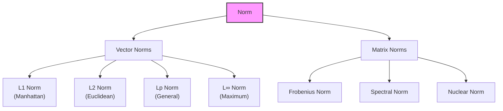
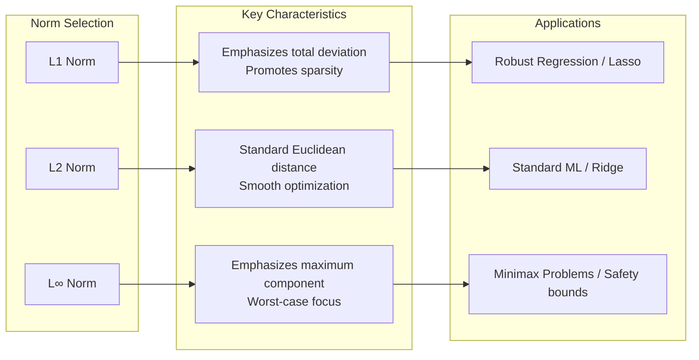
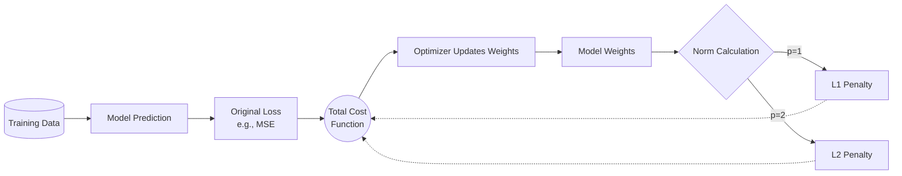

## Definition

A norm is a mathematical function that assigns a non-negative real number to each element of a vector space (or matrix space), representing its "size" or "magnitude." The norm generalizes the concept of length or absolute value, providing a way to measure distance and magnitude in abstract mathematical spaces. In a vector space $V$, a norm is a function $\|\cdot\|: V \to \mathbb{R}$ satisfying specific mathematical properties that ensure it produces meaningful measurements of vector magnitude.

A norm must satisfy the following axioms:

### Norm Axioms

1. **Positive Definiteness**: $\|v\| \geq 0$ for all $v \in V$, and $\|v\| = 0$ if and only if $v = 0$.
2. **Homogeneity**: $\|cv\| = |c| \cdot \|v\|$ for all scalars $c$ and vectors $v \in V$.
3. **Triangle Inequality**: $\|u + v\| \leq \|u\| + \|v\|$ for all vectors $u, v \in V$.

These properties ensure that norms behave intuitively and consistently with our understanding of distance and magnitude.

## Calculation

Different types of norms are defined based on how they compute the magnitude of a vector. For a vector $\mathbf{v} = (v_1, v_2, \ldots, v_n)$ in $\mathbb{R}^n$, the most common norms are:

### L1 Norm (Manhattan Norm)

The L1 norm, also known as the Manhattan norm or taxicab norm, sums the absolute values of all components:

$$\|\mathbf{v}\|_1 = \sum_{i=1}^{n} |v_i| = |v_1| + |v_2| + \cdots + |v_n|$$

* **Example**: For $\mathbf{v} = (3, -4, 2)$, the L1 norm is $|3| + |-4| + |2| = 3 + 4 + 2 = 9$.

### L2 Norm (Euclidean Norm)

The L2 norm, also called the Euclidean norm, is the most commonly used norm and represents the standard distance formula:

$$\|\mathbf{v}\|_2 = \sqrt{\sum_{i=1}^{n} v_i^2} = \sqrt{v_1^2 + v_2^2 + \cdots + v_n^2}$$

* **Example**: For $\mathbf{v} = (3, -4, 2)$, the L2 norm is $\sqrt{3^2 + (-4)^2 + 2^2} = \sqrt{9 + 16 + 4} = \sqrt{29} \approx 5.39$.

### Lp Norm (General Lp Norm)

The Lp norm generalizes both L1 and L2 norms for any $p \geq 1$:

$$\|\mathbf{v}\|_p = \left(\sum_{i=1}^{n} |v_i|^p\right)^{1/p}$$

* **L1 Norm**: When $p = 1$
* **L2 Norm**: When $p = 2$
* **L3 Norm**: When $p = 3$, $\|\mathbf{v}\|_3 = \left(\sum_{i=1}^{n} |v_i|^3\right)^{1/3}$

### L∞ Norm (Maximum Norm)

The L∞ norm, also called the Chebyshev norm or maximum norm, returns the largest absolute value among all components:

$$\|\mathbf{v}\|_{\infty} = \max_{i} |v_i|$$

* **Example**: For $\mathbf{v} = (3, -4, 2)$, the L∞ norm is $\max(|3|, |-4|, |2|) = 4$.

### Matrix Norms

Norms can also be defined for matrices. Common matrix norms include:

- **Frobenius Norm**: $\|A\|_F = \sqrt{\sum_{i=1}^{m} \sum_{j=1}^{n} |a_{ij}|^2}$ (similar to L2 norm for vectors)
- **Spectral Norm**: $\|A\|_2 = \sqrt{\lambda_{\max}(A^T A)}$ (largest singular value)
- **Nuclear Norm**: Sum of all singular values

## Interpretation

The value of a norm represents the "size" or "magnitude" of the vector or matrix:

* **Zero Norm**: Only the zero vector has a norm of zero. For any non-zero vector, the norm is strictly positive.
* **Comparing Magnitudes**: Norms allow comparison of vector magnitudes. A vector with norm 10 is "twice as large" as a vector with norm 5.
* **Distance Measurement**: The norm of the difference between two vectors $\|\mathbf{u} - \mathbf{v}\|$ represents the distance between them in the vector space.
* **Norm Selection**: Different norms emphasize different aspects of the vector:
    * **L1 Norm**: Emphasizes the total deviation (used in robust regression and sparse models)
    * **L2 Norm**: The standard Euclidean distance (most intuitive, used in most applications)
    * **L∞ Norm**: Emphasizes the maximum component (useful for worst-case analysis)

## Necessity

Norms are essential in mathematics and its applications for several critical reasons:

- **Optimization**: Many optimization algorithms minimize objective functions based on norms. For example, least squares regression minimizes the L2 norm of residuals.
- **Convergence Analysis**: In numerical analysis, norms measure the error and determine whether iterative algorithms are converging.
- **Machine Learning**: Regularization techniques (L1, L2 regularization) use norms to prevent overfitting by penalizing large weights.
- **Functional Analysis**: Norms define the structure of normed vector spaces, which form the foundation of advanced mathematical theory.
- **Signal Processing**: Norms measure signal energy, energy consumption, and signal similarity.
- **Computer Graphics**: Norms are used to normalize vectors (unit vectors) for lighting calculations and transformations.

Without norms, we would lack a rigorous mathematical framework for measuring and comparing magnitudes in abstract spaces, making it impossible to formulate many problems in optimization, analysis, and applied mathematics.

## Limitations and Alternatives

Despite their utility, norms have certain limitations:

- **Norm Dependency**: Different norms can yield different conclusions about the same vector. A vector may have a small L∞ norm but a large L1 norm.
- **Computational Cost**: Some norms (especially matrix norms like the spectral norm) are computationally expensive to calculate.
- **Information Loss**: A norm reduces a multi-dimensional object to a single scalar value, losing information about the distribution of components.
- **Context Sensitivity**: Choosing the appropriate norm depends on the application context, and an inappropriate choice may lead to misleading results.

### Alternatives

- **Metric**: A more general distance function that doesn't necessarily satisfy all norm axioms but provides distance measurements between points.
- **Semi-norm**: A weaker version of a norm that allows non-zero vectors to have zero semi-norm.
- **Weight-based Metrics**: Weighted norms that assign different importance to different components, such as $\|\mathbf{v}\|_w = \sqrt{\sum_{i=1}^{n} w_i v_i^2}$.
- **Relative Measures**: Instead of absolute norms, use ratios or normalized values for comparison purposes.

## Derived Subsequent Concepts

The concept of norms has led to numerous advanced mathematical and computational developments:

- **Normalized Vectors**: Division of a vector by its norm produces a unit vector with norm 1, essential for direction representation without magnitude information. In machine learning and neural networks, vector normalization is a preprocessing step that improves training stability and convergence.

$$\mathbf{u} = \frac{\mathbf{v}}{\|\mathbf{v}\|}$$

- **Banach Spaces**: Normed vector spaces that are complete (every Cauchy sequence converges) form Banach spaces, a fundamental structure in functional analysis.
- **Regularization in Machine Learning**: L1 regularization (Lasso) and L2 regularization (Ridge regression) use norms to constrain model complexity and prevent overfitting.

$$J(\mathbf{w}) = \frac{1}{2m}\sum_{i=1}^{m} (h_\mathbf{w}(\mathbf{x}^{(i)}) - y^{(i)})^2 + \lambda \|\mathbf{w}\|_p$$

Where $\lambda$ controls the regularization strength and $p$ determines the norm type.

- **Inner Product Spaces**: Norms define the geometric structure of inner product spaces (Hilbert spaces), where the L2 norm is derived from the inner product: $\|\mathbf{v}\|_2 = \sqrt{\langle \mathbf{v}, \mathbf{v} \rangle}$.
- **Condition Numbers**: In numerical linear algebra, norms are used to define condition numbers that measure the sensitivity of a solution to perturbations in the input data.
- **Distance-based Algorithms**: K-means clustering, K-nearest neighbors, and other algorithms rely fundamentally on norms to define distances between data points.
- **Gradient Descent Optimization**: The norm of the gradient vector determines the steepness of the objective function, guiding the direction and magnitude of parameter updates in optimization algorithms.
